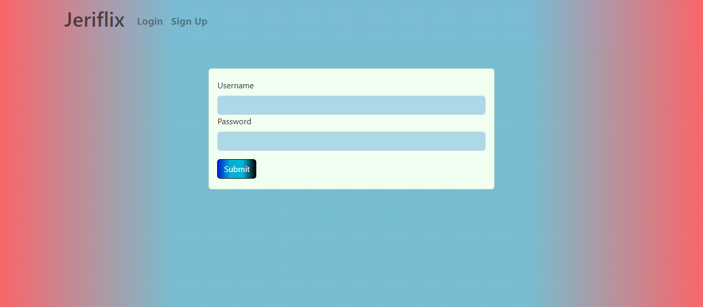
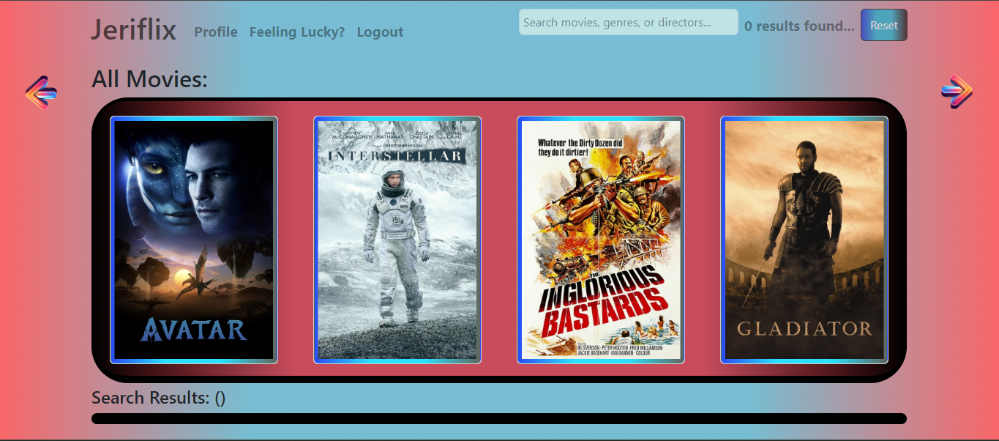
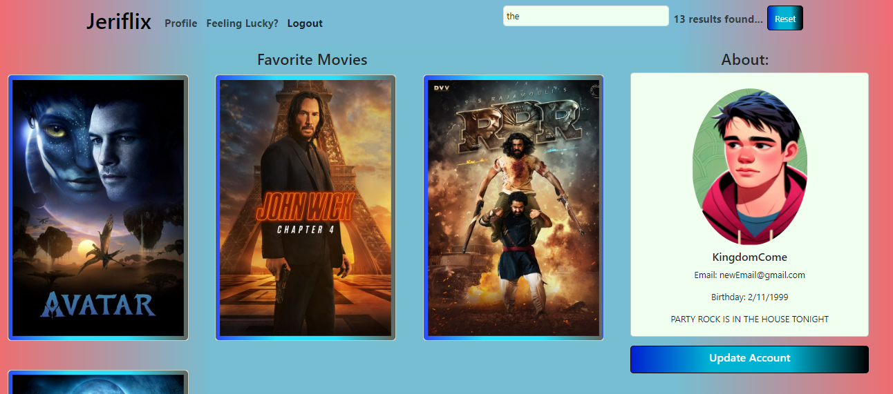
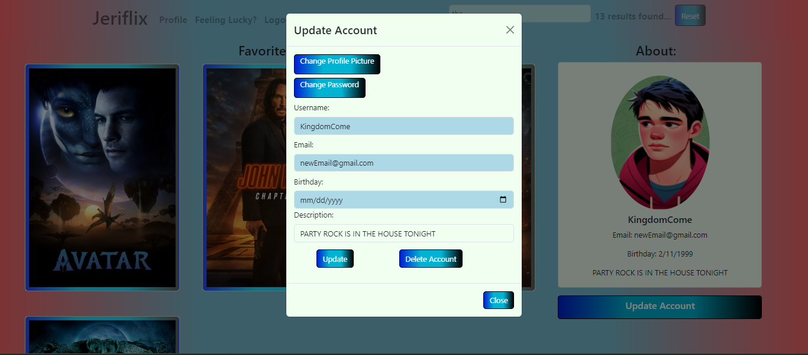
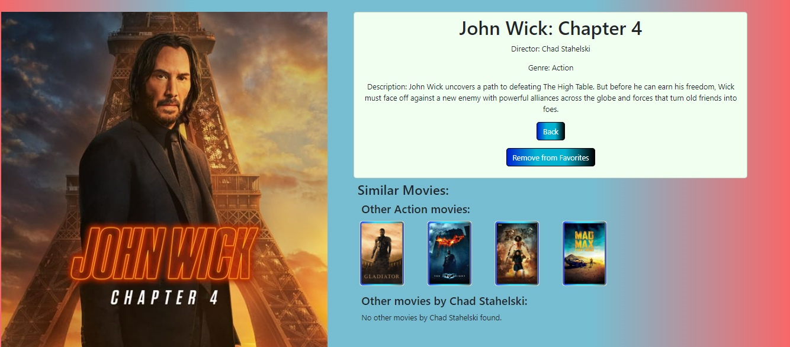

# Jeriflix-Client

This is a Movie app created using React that allows users to create accounts, log-in, view different available movies
and add or delete movies to their Favorites list. The app also showcases different facts about the movies, directors and genres.
## Table of Contents

- [Screenshots](#screenshots)
- [Features](#features)
- [Installation](#installation)
- [Prerequisites](#prerequisites)
- [Technologies](#technologies)
- [Usage](#usage)
- [Contributing](#contributing)
- [License](#license)

## Screenshots

## Features

- View a variety of movies from different Genres and Directors
- Add or remove movies from YOUR Favorites List
- Learn more about your favorite movie.

### Prerequisites

To run JeriFlix, you need a web browser with JavaScript enabled. Other dependencies are listed under
package.json.

### Technologies
* React
* Parcel
* React-Bootstrap
* Render
* MongoDB
* MongoDB Compass
* Netlify
* Postman

### Installation

1. Clone or download the repository to your local machine.
2. install all dependencies
3. run npm start or expo start

Alternatively:
1. open up the website link: https://jeriflix.netlify.app

## Usage

1. Direct yourself to the sign-up page and sign yourself up
2. Head towards log-in and using your newly created credentials, log yourself in.
3. Click and dragon through the movie list to see all the different movies, or 
click on the arrows to the left and right of the movies to scroll through them.
4. Alternatively, you can also search for specific movies on the search bar below.
5. Clicking on a movie card details more information on the movie including a description, genre and director.
You can also add and remove movies from your favorites list from here.
6. You will also see other related movies.
7. You can also click on Profile on the navigation bar and be presented to your own personal profile.
8. You can view your favorite movies list here as well as change any information such as your Password, Email or Birthday. This is also where you can give yourself a profile picture!
9. Once satisfied, feel free to log-out with the navbar's logout button.

## Contributing

Contributions to the Jeriflix App are welcome! If you have any suggestions, bug fixes, or feature enhancements, feel free to open an issue or submit a pull request.

Before contributing, please review the [Code of Conduct](CODE_OF_CONDUCT.md).

## License

Jeriflix is an open-source software licensed under the [MIT License](LICENSE).
